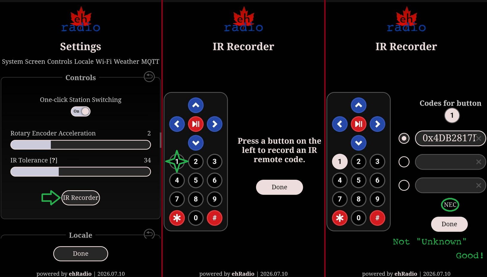
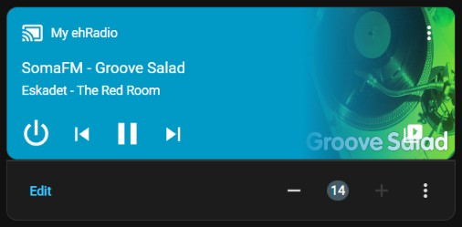

# ehRadio Controls

## Physical Controls

### Rotary Encoders

A rotary encoders is the recommended first choice of input.  One encoder is enough to control the device.

| Encoder Action             | Player Mode             | Playlist Mode |
| -------------------------- | ----------------------- | ------------- |
| Rotate clockwise           | volume up               | next station/track |
| Rotate counter-clockwise   | volume down             | previous station/track |
| Click (Same as `BTN_PLAY`) | start/stop playing      | play selected station/track |
| Double-click               | toggle stations/SD mode | - |
| Long-press                 | enter playlist mode     | exit playlist mode to player mode |

Rotary Encoder 2

| Encoder Action           | Not pressed                                      | While Pressing |
| ------------------------ | ------------------------------------------------ | -------------- |
| Rotate clockwise         | switch to playlist mode & next station/track     | volume up |
| Rotate counter-clockwise | switch to playlist mode & previous station/track | volume down |
| Click and double-click   | switch between player and volume mode | - |

### Buttons

Up to 5 buttons can be connected to the device. Three buttons are enough to control all functions ().

Button actions:
| Button   | Click                   | Double-click            | Long-press |
| -------- | ----------------------- | ----------------------- | ---------- |
| BTN_PLAY | start/stop playing      | toggle stations/SD mode | toggle between player and playlist |
| BTN_DOWN | volume down             | previous station/track  | quick volume down |
| BTN_UP   | volume up               | next station/track      | quick volume up |
| BTN_NEXT | next station/track      | -                       | quick next * nothing if no display |
| BTN_PREV | previous station/track  | -                       | quick next * nothing if no display |
| BTN_MODE | toggle stations/SD mode | -                       | enter sleep (wake up may be another button)

Turning on `One-click Station Switching`  in the WebUI makes `BTN_NEXT` and `BTN_PREV` act instantly instead of switching to Playlist Mode first.
It also essentially disables Long-press.

### IR receiver

IR receivers can be configured from the WebUI. Up to 3 remotes can be used.

1. Go to Settings,  controls, IR Recorder
2. Press the button you need on the left to record the IR code.
3. Select the slot on the right and press the button on the physical IR remote. Avoid `UNKNOWN`.



Repeat for other buttons.

| Button  | Action                 | Longpress Action |
| ------  | ---------------------- | ---------------- |
| &#9199; | start/stop playing     | - |
| &#9664; | previous station/track | - |
| &#9654; | next station/track     | - |
| &#9650; | volume up              | quick volume up |
| &#9660; | volume down            | quick volume down
| #       | toggle between player/playlist mode | - |
| 0-9     | Start entering the station number. To finish input and start playback, press the play button. To cancel, press hash. | - |

### Joystick

You can use a joystick [like this](https://aliexpress.com/item/4000681560472.html) instead of connecting five buttons.


### Touchscreen

- Swipe horizontally: volume control
- Swipe vertically: station selection
- Tap, in player mode: start/stop playback
- Tap, in playlist mode: select
- Long tap, in playlist mode: cancel

---

## Home Assistant Component



A Home Assistant custom integration is available in the `HA` folder.
Put it in a `ehradio` folder in your Home Assistant's `custom_components` folder.

MQTT must be enabled.

Add this to your `configuration.yaml`.
```
media_player:
  - platform: ehradio
    name: My ehRadio
    root_topic: ehradio/myradio/
```

---

## MQTT & Telnet & HTTP

ehRadio has a unified command handler that can process all of the same commands as the WebUI does.

### MQTT

MQTT accepts raw text only.

Publish `<mqtttopic>command` (for example, `ehradio/myradio/command`).

| Format       | Example Payload |
| ------------ | -------------- |
| key=value    | `volume=80` |
| key value    | `play 12` |
| key(value)   | `sleep(30,5)` |
| Bare command | `start` |
| Raw URL      | `http://radio-url/stream` |

### Telnet

Connect to the radio with `telnet <radio-ip>`.

The format is the same as MQTT but with some quirks:
- `quit`/`bye` will close the connection
- `help` will show a short list of useful commands
- `play` with no value is equivalent to `start`
- `play` with a URL is equivalent to `burl`/`playurl`
- `mode 0` radio / `mode 1` SD / `mode 2` toggle between

Connecting with Telnet will also show all serial logs.

### HTTP

All commands go through GET query parameters with no POST body and no special endpoint.
I haven't experimented with every way to send commands but here are some examples.

```
# Single command
curl "http://<radio-ip>/?stop"

# Multiple commands (processed in URL order)
curl "http://<radio-ip>/?volume=70&treble=4&bass=-2"

# Sleep timer (sleep and after are merged: "30,5")
curl "http://<radio-ip>/?sleep=30"
curl "http://<radio-ip>/?sleep=30&after=5"

# Play a station by index
curl "http://<radio-ip>/?play=3"

# Toggle play/pause
curl "http://<radio-ip>/?toggle=1"

# Reboot
curl "http://<radio-ip>/?reboot=1"
```

Note: the value matters - even for boolean toggles you need a value (for example ?toggle=1).
`sleep` and `after` are a special case: they're merged into sleep=for,after before dispatch.
The server responds 200 with empty body on success, 404 on unrecognized commands.
Some commands (like reset or clearspiffs) trigger a redirect to `/`.

For a (hopefully) complete list of commands, check out [Commands](Commands.md).
In case this list is incomplete, `commandhandler.cpp` will show everything.
