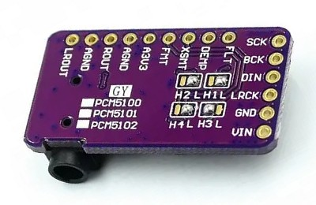
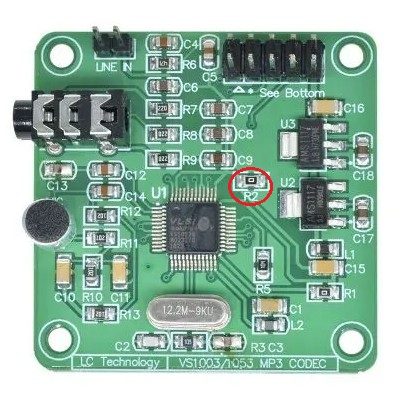
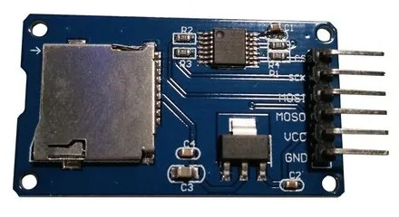

# ehRadio Hardware Choices

There are many considerations to make when building a radio.
Here are listed all of the supported hardware, some with more detail than others.

When in doubt, also consult the [myoptions Generator](https://trip5.github.io/ehRadio/myoptions/generator.html)
which also contains tips about the hardware.

## ESP Board

I recommend using an S3 board with at least 2MB of PSRAM and 8MB of flash. I personally build with ESP32-S3 N16R8 boards.

It may be possible to use a board with 4MB of flash but will require special partitioning.

This code may still run on an ESP32 but without PSRAM will have serious issues that may be unfixable.

It is also possible to build with an ESP32-C3 but since that is not a dual-core CPU, it would be prudent to avoid larger and/or SPI displays.

I strongly recommend choosing a board which has the option of an external antenna.

I also recommend using a minimum of 470µF 10V capacitor somewhere in your circuit across the `5V` and `GND` (attach negative to `GND`).
It helps to stablize the system during boot and smooth out the sudden power draw during operations like initializing the decoder, screen, wi-fi, etc.
It doesn't really matter where as long as the `5V` is in common with the power-input of the ESP.
I put mine on the SD Card Reader.  Putting it directly on the ESP pins is also an option.
You may size up either number.  I usually use a 1000 µF 16V or 25V capacitor.

---

## Display

Building with a display is not strictly necessary.

### TFT / IPS Color Displays

SPI color TFT displays all look pretty good (IPS versions will always look better even if they don't photograph well).

| Display | Default Resolution | Other Resolutions Supported | Note |
| ------- | ------------------ | --------------------------- | ---- |
| GC9A01A | 240x240 round      | No                          |      |
| GC9106  | 160x80             | No                          |      |
| ILI9225 | 220x176            | Yes                         |      |
| ILI9341 | 320x240            | No                          |      |
| ILI9488 | 480x320            | Yes                         | uses a 24-bit bus so can be slow to update (choose the ST7796 if you want a display that updates faster) |
| ILI9486 | 480x320            | Yes                         | not fully tested - see notes inside the library regarding gamma correction |
| ST7735  | 160x128            | * see below *               | works well, cheap |
| ST7789  | 320x240            | Yes                         |      |
| ST7796  | 480x320            | Yes                         |      |

If the display is listed as supporting other resolutions, then the following resolutions are available: `480x320`, `320x240`, `284x76`, `240x240`, `220x176`, `160x128`, `160x80`, and `128x128`.
Non-default width or height must be specified in `myoptions.h`.

The ST7735 has several subtypes in the Adafruit driver, as specified by `DTYPE`, which also sets the resolution.

| ST7735 Subtype | Resolution | Note |
| -------------- | ---------- | ---- |
| BLACKTAB       | 160x128    | default unless DYTPE is specified |
| GREENTAB       | 160x128    |      |
| REDTAB         | 160x128    |      |
| 144GREENTAB    | 128x128    |      |
| MINI160x80     | 160x80     |      |

If you have a `160x128` and the default `BLACKTAB` doesn't work, try `GREENTAB` and `REDTAB`.

### OLED Monoochrome Displays

OLEDs are cheap, beautiful (in a retro way) and just as functional.

| Display | Interface  | Default Resolution |
| ------- | ---------- | ------------------ |
| SH1106  | SPI or I2C | 128x64 |
| SH1107  | SPI or I2C | 128x64 |
| SSD1305 | SPI or I2C | 128x64 |
| SSD1306 | SPI or I2C | 128x64 |
| SSD1322 | SPI only   | 256x64 |
| SSD1327 | SPI or I2C | 128x64 |

All OLED displays support various resolutions: `256x64`, `128x128`, `128x64`, and `128x32`.
Non-default width or height must be specified in `myoptions.h`.

### LCD Displays

Not recommended but supported anyways, thanks to inheriting ёRadio display architecture.
LCD displays like the 1602, 2004, and Nokia 5110 may work but will not be as good-looking as the others.

| Display   | Interface       | Default Resolution |
| --------- | --------------- | ------------------ |
| 1602      | Parallel or I2C | 16x2 characters    |
| 2004      | Parallel or I2C | 20x4 characters    |
| NOKIA5110 | SPI             | 84x48 dot-matrix   |
| ST7920    | SPI             | 128x64 dot-matrix  |

---

## Audio Decoder

ehRadio currently uses the `ESP32-audioI2S` library from [Maleksm's ёRadio mod v0.9.434m](https://4pda.to/forum/index.php?showtopic=1010378&st=11240#entry125839228),
likely mostly from schreibfaul1's library [3.1.0 January 7, 2025](https://github.com/schreibfaul1/ESP32-audioI2S/releases/tag/3.1.0).

For VS1053 decoding, ehRadio uses the `ESP32-vs1053_ext` library from `nsteplanets` [PR226](https://github.com/e2002/yoradio/pull/226) to yoRadio.

Both libraries have been further optimized to get the best playback possible.

There are notes in the `libraries` folder regarding some of the "Frankenstein" operations I have performed (since I know very little about decoding libraries).

For that and other major needed changes to the codebase, there is a `code-issues.md` file which may be a messy file to look at, depending on how these efforts are going.

### I2S

I2S Decoders use the CPU to decode data so it can be used with many types of streams.
It does put pressure on the CPU so it does have trouble running with large SPI displays.
I have done my best to mitigate that but it is what is.

I2S decoders are cheap and plentiful and I don't think anyone has ever worrried about buying a fake.

A good I2S Decoder is the PCM5102 but be sure to set the jumpers as in this picture.

The UDA1334 should work and there are likely others.

You will need an amplifer when building with a DAC like these. I have used the PAM8406.
PAM IC amps are generally easy to work with but... your mileage will vary.

The ES8311 is a mono I2S decoder included on some dev board / display combos.  It's not terrible.

### VS1053

*The VS1053 is supported but not recommended.*

I love the idea of the VS1053.  It decodes streams directly and relieves pressure from the CPU.
Whereas I2S decodes streams using the CPU, the VS1053 can decode most popular codecs directly on the board,
relieving the CPU to handle other functions...

But the technology behind the VS1053 (2009) pre-dates the ESP8266 (2013) and the libraries have not
received the same attention from developers as the I2S decoding routines.

There are many additional issues as well so it is probably best to reserve building using the VS1053 when using very slow displays like the ILI9488.
It also has a weak built-in amplifer which can simplify builds.

For the VU Meter to function, the patch MUST be enabled.
Even with the patch, though, it struggles to decode FLAC streams and some other "unusual" stream types.

The so-called "Green Board" is the cheapest and easiest to find but don't assume it is a genuine VS1053.
Some are sold as "VS1003/1053" which are almost certainly a VS1003.
This can be verified by checking the LDO power-regulators. If the board has a 2.5V LDO instead of a 1.8V LDO, it's a VS1003.
Genuine VS1053 is usually $10 minimum. Shop carefully and don't buy the cheapest one.

If you end up with a VS1003, it will still be functional for MP3 stations but not much else.
It cannot use the patch and there will be no audio if you use `#define VS_PATCH_ENABLE true` in `myoptions.h`.

It is recommended to remove the resistor marked `R2` to prevent the VS1053 from accidentally entering "MIDI mode"
on boot (which would also prevent the patch from being applied - again resulting in no audio).
I'm not sure if this resistor is a problem on other VS1053 boards.

ESP32-S3 GPIO pins have an incredibly fast transition time (slew rate), which is around 1-2ns.
Even with short wires around 10-15 cm, these sharp edges cause severe signal reflections ("ringing").
A 33Ω resistor placed right next to the ESP32 pin before wiring to the VS1053 boared provides source impedance matching
and damps the reflected wave, preventing data micro-glitches.
Acceptable alternatives to 33Ω are in the range of 22Ω to 47Ω.  No higher or lower.

Importantly, this is critical not only for the clock and data lines (SCK and MOSI) but also for the chip select lines (XCS and XDCS).
If a sharp edge causes ringing or cross-talk from the adjacent SCK wire on these strobe lines, the noise amplitude can falsely cross the logic threshold.
As a result, the decoder might assume the communication session was interrupted right in the middle of a data frame transfer.
This may manifest in the logs with excessive `slow stream, dropouts are possible` messages as well as with audio artifacts like pops and clicks.

---

## Controls

ehRadio can be built with various control methods, including rotary encoders, buttons, an IR receiver, touchscreen, WebUI, Home Assistant, MQTT, Telnet, and HTTP.

The most basic physical control is a rotary encoder.  All functions can be accomplished with just one encoder.

Buttons may also be used. Touch is swipe and tap motions only.

Regarding Deep Sleep: Wake is only possible on RTC-capable pins. On the ESP32, these are RTC GPIOs: `0`, `2`, `4`, `12-15`, `25-27`, `32-39`.
ESP32-S3/C3 RTC GPIOs are: `0-21`. Inputs assigned to these pins will automatically be used for Wake
(unless Sleep is explicitly disabled with `#define DEEP_SLEEP_DISABLE` in `myoptions.h`).

Information on how the controls function detailed are [here](Controls.md).

---

## SD Card Reader

An SD card reader may be added to the build.
It is recommended to be wary of SD readers built onto displays, although some may work.
SD reader modules like this are cheap.

The SD mode should be considered as a "fallback because wi-fi is not available" mode, not a primary playback mode.

While in "AP/Improv Mode" (automatically entered when wi-fi connection cannot be established),
the user may use the physical controls (double-click of a rotary or the mode button) to enter a special SD Offline mode.
Actually the radio reboots without initializing network functionality.

It is recommended to encode files on SD card using MP3 256kbps or less to avoid system stress.
Metadata information cannot be displayed on a VS1053 build using non-MP3 formats.

---

## RTC

An I2C RTC module may be added to the build as well.  This *should* keep the time when network connectivity is unavailable.

Supported RTC modules include DS3231 and DS1307.
