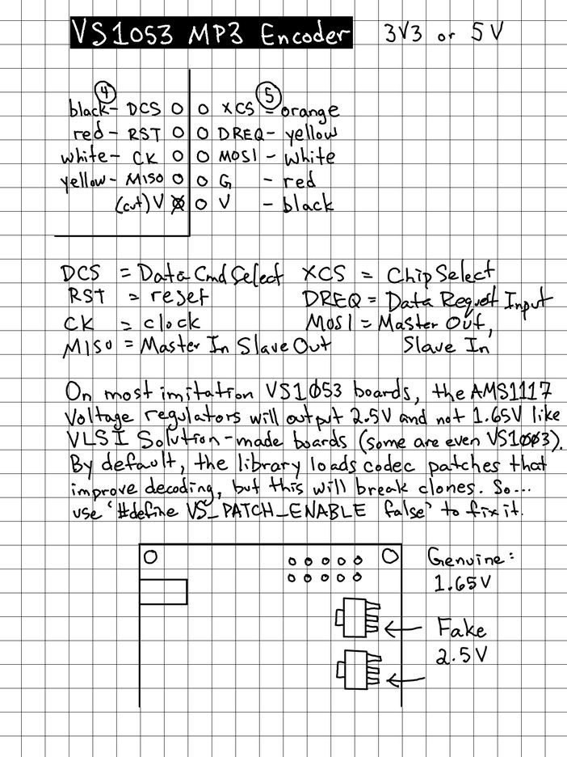
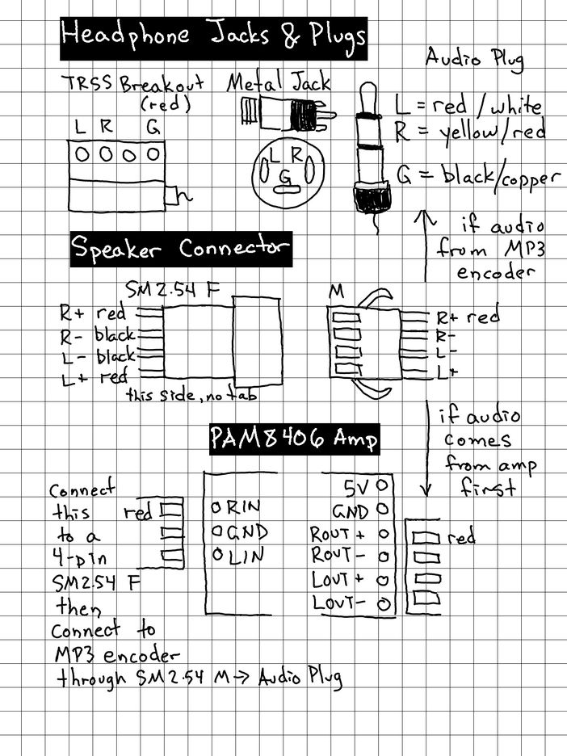
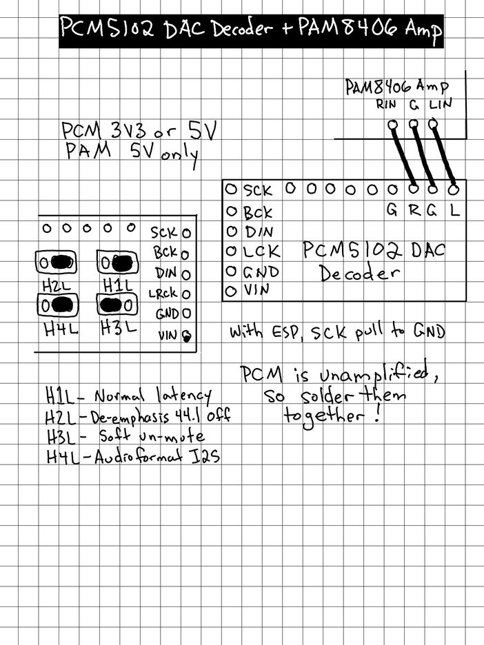
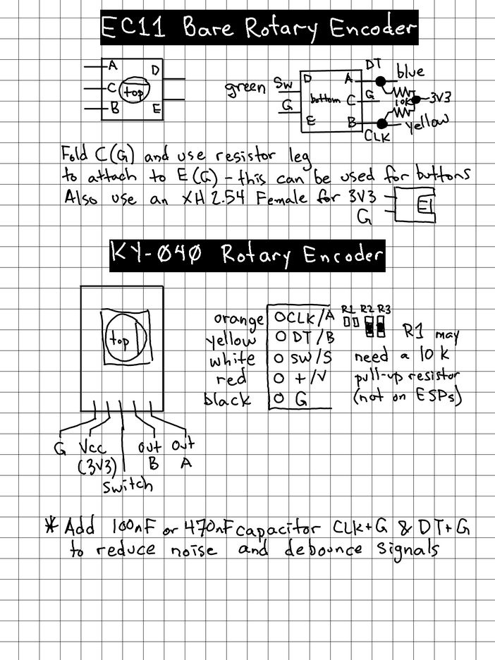
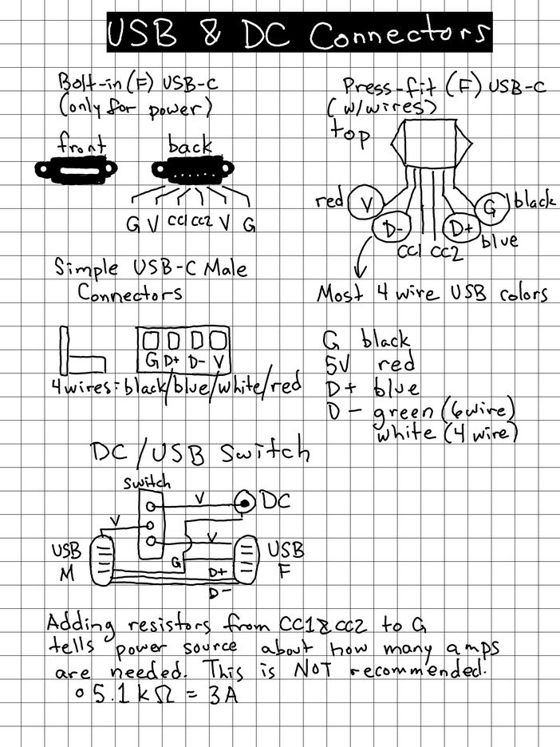
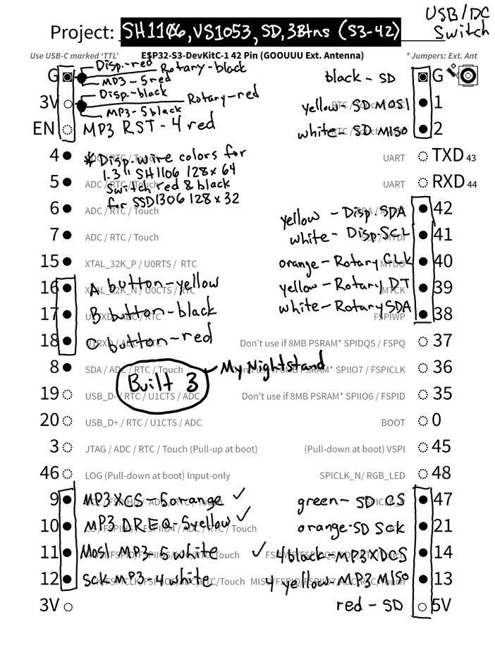
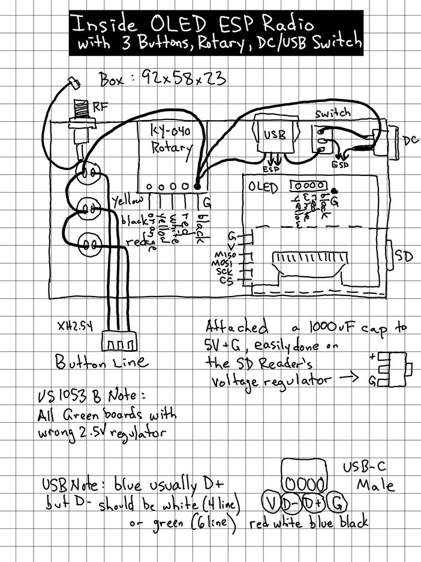

## Trip5's Notebook

I keep a digital notebook of various builds I have made along with tips and important notes.
Here are some pages.

### VS1053 Decoder

### Audio Jacks & PAM8406 Amplifier

### PCM5102 Decoder + PAM8406 Amplifier

### Rotary Encoders

### USB & DC Connectors

### sh1106_vs1053_3buttons Connections

### sh1106_vs1053_3buttons Case

